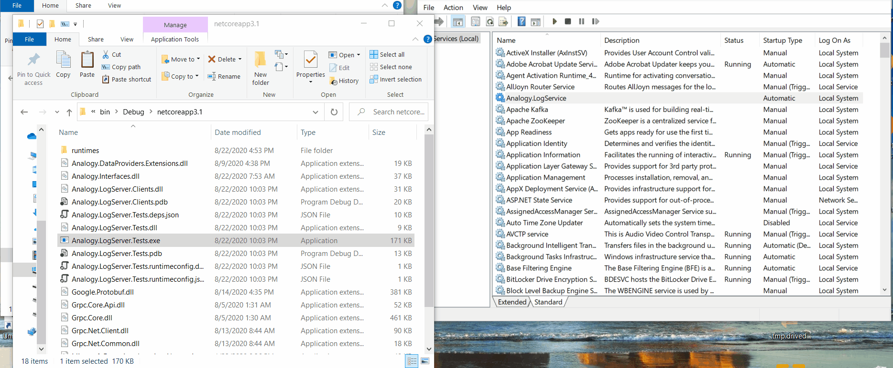

# Analogy gRPC Receiver    

    
 
  

gRPC data provider for Analogy Log Viewer

The following modules exists:
| Nuget   |      Version      |  Description |
|----------|:-------------:|------|
| [Analogy.LogViewer.gRPC](https://www.nuget.org/packages/Analogy.LogViewer.gRPC/) |    | Primary Analogy Log Viewer grRPC providers |
| [Analogy.LogServer](https://www.nuget.org/packages/Analogy.LogServer/) |    | A windows Service for receiving logs |
| [Analogy.LogServer.Clients](https://www.nuget.org/packages/Analogy.LogServer.Clients/) |    | gRPC client to pull back messages from Analogy Service |

With Analogy Log Service you can have multiple executables sending messages to the log service and have Analogy Log Viewer consume those messages:

To install Analogy Log Server as windows service use the following command line:
> sc create Analogy.LogServer binpath=full path to Analogy.LogServer.exe file
